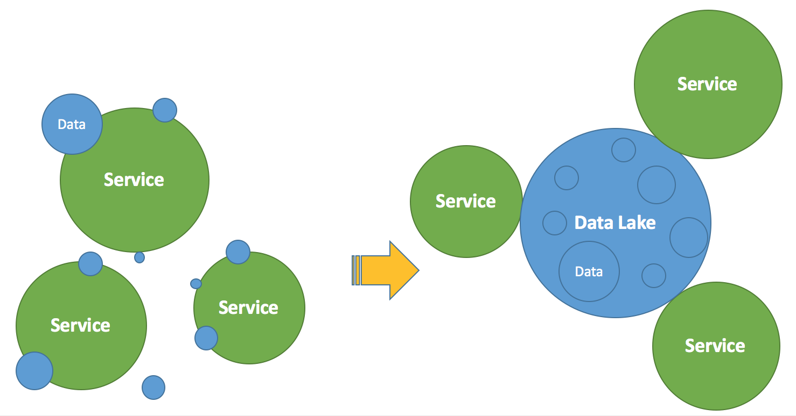

# History
There is a flood of interest in learning how to processing data in large-scale systems in terms of extract, transform, load in real time, partly because there are situations in which the time-value of data makes real-time analytic so attractive and important. 

But gathering in-the-moment insights with complex data processing in the fly is extremely difficult. Although, there are available big data framework or applications available to such use case, there are either too complex to use or incapable for particular type of jobs. In addition, most time we need to combine both history data and real-time data together because history data accumulate values and asset for prediction and tuning the data in the fly. All of these requirements make existing big data framework alone, such as [Hadoop](http://hadoop.apache.org/), [Hive](http://hive.apache.org/), [Pig](http://pig.apache.org/), [Spark](http://spark.apache.org/), [Flink](https://flink.apache.org/), [Storm](https://storm.apache.org/), etc, not applicable well. Most companies start building in-house solutions to solve this technical issues. And, this is why it comes to the creation of DataFibers to provide a way ease of generic big data processing. 

### Architecture
The big data processing architecture adapts to the speed and demanding for exploring values behind of the big data. The architectures of big data processing have three milestones during this evolution. 

#### Batch Processing Architecture
In the earlier period of big data processing, aka Hadoop 1.0 era, most big data processing was based on Hive/Pig and MapReduce batch jobs. At that time, big data batch job gained attention over traditional data warehouse applications in terms of cost, stability, and performance. At nowadays, batching processing is still playing an important role in most enterprises as transaction from legacy data processing framework.

#### Hybrid Processing Architecture
When [IoT](https://en.wikipedia.org/wiki/Internet_of_things) becomes popular, there are quite a lot demanding on the speed of acquiring data. Apache Storm, Apache Spark, Flink, Kafka attracts more attention on their steaming data processing. In addition, more use cases using ad-hoc analytic queries on Hadoop data make batch processing, the single solution, awkward and frustrated. Lots demo or POC are started as sperate streaming based big data processing system parallel running with batch processing system. What's more, [Lambda Architecture](https://en.wikipedia.org/wiki/Lambda_architecture) comes to the picture of big data processing for the very first time.

#### Unified Processing Architecture

Most companies have started or been staring evolve from pure batch to pure stream big data architecture as follows. There are reasons arranged from legacy warehouse maintenance to technology maturity. Some company are still in the first two architectures. However, Lamdba is not recommended because of complexity and overhead, unless the company has very closed dependency on legacy data pipe and their big data architecture was already matured in the last three years. Kappa is where leading data company approaching.

### Service

#### Data Oriented and Centric

#### Data Application vs. Framework

